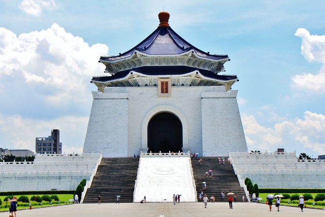
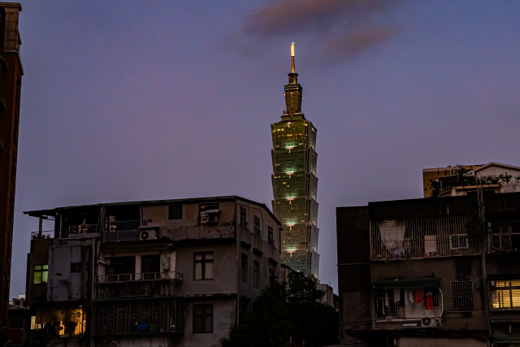
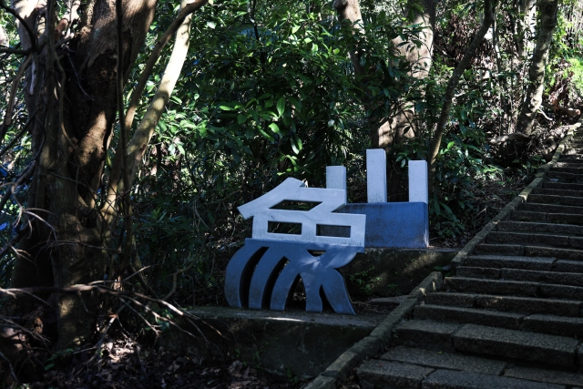

# 

  <h1>Travel Information in Taipei</h1>

  

    <a href="">About</a> &nbsp;&bull;&nbsp;
    <a href="">Culture</a> &nbsp;&bull;&nbsp;
    <a href="">Weather</a> &nbsp;&bull;&nbsp;
    <a href="">Transportation</a> &nbsp;&bull;&nbsp;
    <a href="">Food</a> &nbsp;&bull;&nbsp;
    <a href="">Attractions</a>
  

## :bulb: About

kjsndlkjfnaslkjdfnaljskdfnaksd,mfnkamsd,f
adsjfnlaksjdnfkajsdnflkajsndfkajs,dnfjkasdfnakjsdnfakjsdnfajs,dnfkjasdf
sdjfnakjsdnfljkasdnfjmas

## Culture
> Taiwan Government https://www.taiwan.gov.tw/content_3.php
> You can find the history and culture information here.

Taiwan culture is a fusion of traditional Chinese, Japanese, and also Western influences.
Taiwan is the first country in Asia to legalize same-sex marriage.
Taipei, the capital of Taiwan, is a great place to explore both traditional and modern lifestyles.

Tipping culture in Taiwan is not common.
Basically, eating in restaurants would have additional 10% service charge added to your bill.
Most of time, there is no need to tip, even for the room cleaners of hotels.

## 🌈 Weather
> Central Weather Administration: https://www.cwa.gov.tw/eng/

kjsndlkjfnaslkjdfnaljskdfnaksd,mfnkamsd,f
adsjfnlaksjdnfkajsdnflkajsndfkajs,dnfjkasdfnakjsdnfakjsdnfajs,dnfkjasdf
sdjfnakjsdnfljkasdnfjmas

## 🚆 Transportation
> adshgfjklasdnlgivkajsd;filkjas;doifjkasijfjoi;as
> 
- Getting around Taipei is super convenient with its efficient public transport system.
- MRT (Mass Rapid Transit): The best way to travel! Clean, fast, and cheap. Most attractions are near MRT stations.
- Buses: Good for short trips, but can be confusing for non-locals. Use Google Maps for navigation.
- YouBike (Bike Sharing): Great for short rides around the city. You need an EasyCard to rent one.
- Taxis/Uber: Affordable. Taxis are metered, and Uber works well.
- High-Speed Rail (HSR): If you want to travel outside Taipei (e.g., Taichung, Tainan, Kaohsiung), the HSR is the fastest option.

### From Taiwan Taoyuan International Airport (TPE) to Taipei
> Land Transportation in Taiwan Tourism Administration https://eng.taiwan.net.tw/m1.aspx?sNo=0029023
>
If you land Taoyuan International Airport, you need to take Taoyuan Metro to go to Taipei Main Station.
In Taipei, we recommend you to purchase an Easy Card and top up the Easy Card.
Buying an Easy Card, you need to use cash, so please prepare some cash in advance!

## 🧋 Taste of Taiwan
> Food section in Taiwan Tourism Administration https://eng.taiwan.net.tw/m1.aspx?sNo=0002026

kjsndlkjfnaslkjdfnaljskdfnaksd,mfnkamsd,fdsfhjkldsajfnlkasdjhflkasdjhflksdjflksajdfl;kajsd;flkjasdl;kfjas;dlkfjaskdfsadfasdf
adsjfnlaksjdnfkajsdnflkajsndfkajs,dnfjkasdfnakjsdnfakjsdnfajs,dnfkjasdfadslkghlauksdjfnlkajsndflkjnasdkljfnsakldjfnaskjdnfksdjanf
sdjfnakjsdnfljkasdnfjmasdsalkfnbljbglkjasnglkjasnflkdsnflkasdfjlaksdjf

    
<b>Local Food</b>

    kjsndlkjfnaslkjdfnaljskdfnaksd,mfnkamsd,f  
    adsjfnlaksjdnfkajsdnflkajsndfkajs,dnfjkasdfnakjsdnfakjsdnfajs,dnfkjasdf  
    sdjfnakjsdnfljkasdnfjmas

    
<b>Food near NTUST</b>

    
<b>Night Market</b>

    <ul>
        <li><b>Shilin Night Market (士林夜市)</b>: Best for classic street food.</li>
        <li><b>Raohe Night Market (饒河夜市)</b>: Famous for black pepper buns.</li>
        <li><b>Ningxia Night Market (寧夏夜市)</b>: Great for traditional Taiwanese snacks.</li>
    </ul>

    
<b>Must-Try Dishes</b>

    
<b>Halal</b>

    清真飲食
> https://eng.taiwan.net.tw/m1.aspx?sNo=0020323

    
<b>Indian</b>

    印度料理

    
<b>Vegan</b>

    素食餐廳

## Must-Visit Attractions
<table>
  <tr>
    <td>
      <h3>Chiang Kai-shek Memorial Hall</h3>
      
    </td>
    <td>
      Chiang Kai-shek Memorial Hall boasts magnificent architecture and a grand plaza, where you can also watch the changing of the guard ceremony. Adjacent to it are the National Concert Hall and the National Theatre, offering a rich cultural experience.
    </td>
  </tr>
  <tr>
    <td>
      <h3>The National Palace Museum</h3>
      
    </td>
    <td>
      The National Palace Museum houses one of the largest collections of Chinese art and historical artifacts, offering visitors a glimpse into the rich cultural heritage of China. It is one of the most visited museums in the world.
    </td>
  </tr>
  <tr>
    <td>
      <h3>Taipei 101</h3>
      
    </td>
    <td>
      Taipei 101 is a famous skyscraper known for its innovative design and incredible height, once the tallest building in the world. It offers panoramic views of the city and is a prime spot for shopping and dining.
    </td>
  </tr>
  <tr>
    <td>
      <h3>Xiangshan (Elephant Mountain)</h3>
      
    </td>
    <td>
      Xiangshan, also known as Elephant Mountain, offers one of the best hiking trails in Taipei, with stunning views of the city, including Taipei 101. It's a popular spot for both locals and tourists looking for a scenic escape.
    </td>
  </tr>
</table>

## Payment Methods

In Taiwan, cash is still the most commonly used payment method, especially at traditional markets, street vendors, local eateries, and some taxis. However, credit cards (Visa and Mastercard) are widely accepted at department stores, chain retailers, hotels, and larger restaurants.

Mobile payments are also becoming increasingly popular. Common apps include LINE Pay, JKOPay (街口支付), Apple Pay, and QR code payments supported by major local banks.

Note: Some of these services may only work with local bank accounts, so it’s a good idea to carry some cash just in case.

sdjfnakjsdnfljkasdnfjmas
## Visa
Many nationalities qualify for visa-free entry to Taiwan for up to 90 days, while others may need a Visa on Arrival or a Tourist Visa. To find out the specific visa requirements based on your nationality, visit: https://www.boca.gov.tw/np-137-2.html

## Accommodation
> akdfnlkjashglkjasndflkjasndfsdfasdf

kjsndlkjfnaslkjdfnaljskdfnaksd,mfnkamsd,f
adsjfnlaksjdnfkajsdnflkajsndfkajs,dnfjkasdfnakjsdnfakjsdnfajs,dnfkjasdf
sdjfnakjsdnfljkasdnfjmas
## Others
> akdfnlkjashglkjasndflkjasndfsdfasdf

kjsndlkjfnaslkjdfnaljskdfnaksd,mfnkamsd,f
adsjfnlaksjdnfkajsdnflkajsndfkajs,dnfjkasdfnakjsdnfakjsdnfajs,dnfkjasdf
sdjfnakjsdnfljkasdnfjmas

