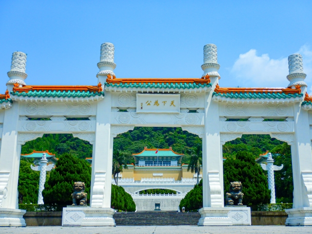
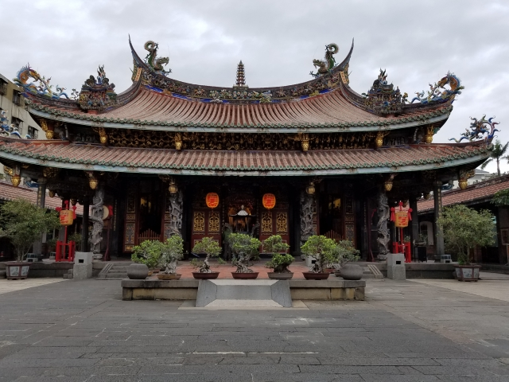
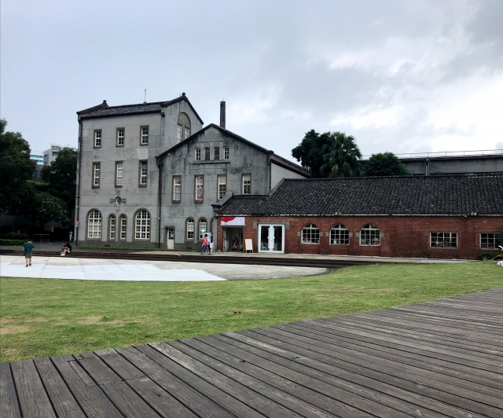

  <h1>Travel Information in Taipei</h1>

  

    <a href="#-about">About</a> &nbsp;&bull;&nbsp;
    <a href="#culture">Culture</a> &nbsp;&bull;&nbsp;
    <a href="#-weather">Weather</a> &nbsp;&bull;&nbsp;
    <a href="#-transportation">Transportation</a> &nbsp;&bull;&nbsp;
    <a href="#-food">Food</a> &nbsp;&bull;&nbsp;
    <a href="#must-visit-attractions">Attractions</a> &nbsp;&bull;&nbsp;
    <a href="#visa">Visa</a> &nbsp;&bull;&nbsp;
    <a href="#accommodation">Accommodation</a> &nbsp;&bull;&nbsp;
  

## :bulb: About

This document aims for helping international travelers to come to Taiwan!
Patch welcome!

## Culture
> Taiwan Government https://www.taiwan.gov.tw/content_3.php
> You can find the history and culture information here.

Taiwan culture is a fusion of traditional Chinese, Japanese, and also Western influences.
Taiwan is the first country in Asia to legalize same-sex marriage.
Taipei, the capital of Taiwan, is a great place to explore both traditional and modern lifestyles.

Tipping culture in Taiwan is not common.
Basically, eating in restaurants would have additional 10% service charge added to your bill.
Most of time, there is no need to tip, even for the room cleaners of hotels.

## 🌈 Weather
> Central Weather Administration: https://www.cwa.gov.tw/eng/

COSCUP usually takes place in the summer, around July or August.
It’s typically hot, humid, and sometimes rainy in Taiwan during that time—and yep, the occasional typhoon might show up too.
Temperatures usually range from 25 to 33°C.
For more details, you can check out the Central Weather Administration’s website!

## 🚆 Transportation

- Getting around Taipei is super convenient with its efficient public transport system.
- MRT (Mass Rapid Transit): The best way to travel! Clean, fast, and cheap. Most attractions are near MRT stations.
- Buses: Good for short trips, but can be confusing for non-locals. Use Google Maps for navigation.
- YouBike (Bike Sharing): Great for short rides around the city. You need an EasyCard to rent one.
- Taxis/Uber: Affordable. Taxis are metered, and Uber works well.
- High-Speed Rail (HSR): If you want to travel outside Taipei (e.g., Taichung, Tainan, Kaohsiung), the HSR is the fastest option.

### From Taiwan Taoyuan International Airport (TPE) to Taipei
> Land Transportation in Taiwan Tourism Administration https://eng.taiwan.net.tw/m1.aspx?sNo=0029023
>
If you land Taoyuan International Airport, you need to take Taoyuan Metro to go to Taipei Main Station.
In Taipei, we recommend you to purchase an Easy Card and top up the Easy Card.
Buying an Easy Card, you need to use cash, so please prepare some cash in advance!

## 🧋 Taste of Taiwan
> Food section in Taiwan Tourism Administration https://eng.taiwan.net.tw/m1.aspx?sNo=0002026

Taipei is an international city. 

    
<b>Local Food</b>

Taipei is home to a vibrant street food culture, especially in its night markets. Here are the top street foods you should try when you're in the city, along with some recommended places to enjoy them:

#### 1. **Beef Noodle Soup (牛肉麵)**
   - A signature dish of Taipei, consisting of tender beef and chewy noodles in a savory broth.
   - **Recommended Places**:
     - **(蔥燉牛肉麵)**[<a href="https://maps.app.goo.gl/9H76f98crrergqtR9" target="_blank">Google Map</a>]
     - **(林東芳牛肉麵)**[<a href="https://maps.app.goo.gl/kZXWjDs4jpMqJQYJ9" target="_blank">Google Map</a>]

#### 2. **Oyster Omelette (蚵仔煎)**
   - A popular street food made with fresh oysters, egg, and vegetables, topped with a sweet and savory sauce.
   - **Recommended Places**:
     - **(夜市肉羹蚵仔煎)**[<a href="https://maps.app.goo.gl/Ac8iKdcmaaGrSYrH8" target="_blank">Google Map</a>]

#### 3. **Bubble Tea (珍珠奶茶)**
   - Taiwan's world-famous drink made with tea, milk, and chewy tapioca pearls.
   - **Recommended Places**:

#### 4. **Taiwanese Popcorn Chicken (鹽酥雞)**
   - Crispy deep-fried chicken pieces seasoned with salt, pepper, and basil.
   - **Recommended Places**:

#### 5. **Stinky Tofu (臭豆腐)**
   - Deep-fried tofu with a strong odor but an incredibly rich flavor, usually served with pickled cabbage.
   - **Recommended Places**:

#### 6. **Gua Bao (刈包)**
   - A Taiwanese-style hamburger with braised pork belly, pickled mustard greens, and ground peanuts wrapped in a steamed bun.
   - **Recommended Places**:

#### 7. **Braised Pork Rice (滷肉飯)**
   - A comforting dish consisting of rice topped with slow-braised pork in a savory soy-based sauce.
   - **Recommended Places**:

#### 8. **Taiwanese Sausage with Sticky Rice (米腸)**
   - Grilled sausage wrapped in sticky rice and served with garlic, cucumber, and soy sauce.
   - **Recommended Places**:

#### 9. **Tian Bu La (甜不辣)**
   - Taiwanese-style tempura made from fish cakes, squid, and vegetables, served with a sweet sauce.
   - **Recommended Places**:

#### 10. **Taiwanese Fish Balls (魚丸)**
   - Chewy fish balls served in a light broth, often accompanied by vegetables.
   - **Recommended Places**:

#### 11. **Hot Star Large Fried Chicken (豪大大雞排)**
   - Known for their massive fried chicken pieces, served crispy and juicy.
   - **Recommended Places**:

---

These street foods represent the diverse and delicious food scene of Taipei, and the

    
<b>Food near NTUST</b>

    Food near National Taiwan University of Science and Technology (NTUST) (Mostly located in the Gongguan area, near NTUST)
    <ul>
        <li>NTUST First Student Cafeteria - 美德耐 (Ping Ke Buffet): [<a href="https://maps.app.goo.gl/2avW6UjkkDbgHUwPA" target="_blank">Google Map</a>] - Affordable buffet</li>
        <li>Lan Jia Gua Bao (Steamed Sandwich): [<a href="https://maps.app.goo.gl/VveBWuYJYdWWGypY7" target="_blank">Google Map</a>] - Famous gua bao shop</li>
        <li>Kuang Yi Shi Hao: [<a href="https://g.co/kgs/6hpLeiq" target="_blank">Google Map</a>] - Brunch, light meals </li>
        <li>Gouyi Xia Izakaya (Gongguan Branch): [<a href="https://g.co/kgs/NiuryCK" target="_blank">Google Map</a>] - Japanese izakaya</li>
        <li>Shishlik Pita x Kebab Middle Eastern Restaurant: [<a href="https://g.co/kgs/46LSRTG" target="_blank">Google Map</a>] - Middle Eastern cuisine</li>
        <li>picnic Cafe: [<a href="https://g.co/kgs/aihSgZw" target="_blank">Google Map</a>] - Cafe, light meals </li>
    </ul>

  
<b>Night Market</b>

  <h2>1. Shilin Night Market</h2>
  <ul>
    <li><b>Fried Chicken Cutlet</b>: <a href="https://maps.app.goo.gl/gJ9JDDepeuLvWBF87">📍 Hot-Star</a></li>
    <li><b>Oyster Omelette</b>: <a href="https://maps.app.goo.gl/hNF1WGwqkZ2s38ss6">📍 Zhong Cheng Hao</a></li>
    <li><b>Scallion Pancake</b>: <a href="https://maps.app.goo.gl/aCbCMhZnaTNNQroE7">📍 郭家蔥油餅</a></li>
    <li><b>Cold Noodles</b>: <a href="https://maps.app.goo.gl/TAvpRxMq2baPKUoQ7">📍 Good Friend Cold Noodles</a></li>
    <li><b></b>Papaya Milk: <a href="https://maps.app.goo.gl/ZLWSB71kBCTc7j8w5">📍 簡記木瓜牛奶</a></li>
  </ul>
  <h2>2. Raohe Street Night Market</h2>
  <ul>
    <li><b>Pepper Buns</b>: <a href="https://maps.app.goo.gl/kXgM3zKm8epiqZ1Z7">📍 Fuzhou Pepper Buns (pork pepper buns)</a></li>
    <li><b>Tangyuan</b>: <a href="https://maps.app.goo.gl/e29QpeXaKNE6DzH46">📍 Yu Pin Yuan Iced and Hot Tangyuan - Raohe Branch</a></li>
    <li><b>Spareribs Noodles</b>: <a href="https://maps.app.goo.gl/tSKwufZyCzbvT4dt6">📍 楊排骨酥麵</a></li>
    <li><b></b>Sweet Potato Ball: <a href="https://maps.app.goo.gl/fSvmh6fGqGXqNarLA">📍 快樂QQ球（地瓜球）饒河店</a></li>
  </ul>
  <h2>3. Ningxia Night Market</h2>
  <ul>
    <li><b>Pork Liver Soup</b>: <a href="https://maps.app.goo.gl/McJpQLnKwasaoipT7">📍 Rong's Pork Liver</a></li>
    <li><b>Soybean Pudding</b>: <a href="https://maps.app.goo.gl/zRiyvXNEFVrcvBdH9">📍 Beans Village</a></li>
    <li><b>Stinky Tofu</b>: <a href="https://maps.app.goo.gl/ua4v3vuyusGJrEwy5">📍 林記麻辣臭豆腐</a></li>
    <li><b>Pot Stickers and Dumplings</b>: <a href="https://maps.app.goo.gl/BPeoRxtfiJHPYug69">📍 Fuyang Pot Stickers and Dumplings</a></li>
  </ul>

    
<b>Halal</b>

> https://eng.taiwan.net.tw/m1.aspx?sNo=0020323

    
<b>Indian</b>

    
<b>Vegan</b>

## Must-Visit Attractions
<table>
  <tr>
    <td>
      <h3>The National Palace Museum</h3>
      
    </td>
    <td>
      The National Palace Museum houses one of the largest collections of art and historical artifacts rooted in traditional culture, offering visitors a glimpse into a rich and enduring cultural heritage. It is one of the most visited museums in the world.
    </td>
  </tr>
  <tr>
    <td>
      <h3>Longshan Temple</h3>
      
    </td>
    <td>
      Longshan Temple, located in Taipei’s historic Wanhua District, is one of the most famous temples in the area. With its intricate architecture and serene atmosphere, it’s well worth a visit. In the evening, you can also explore the nearby Huaxi Street Night Market to enjoy a variety of local delicacies.
    </td>
  </tr>
  <tr>
    <td>
      <h3>Xiangshan (Elephant Mountain)</h3>
      
    </td>
    <td>
      Xiangshan, also known as Elephant Mountain, offers one of the best hiking trails in Taipei, with stunning views of the city, including Taipei 101. It's a popular spot for both locals and tourists looking for a scenic escape.
    </td>
  </tr>
  <tr>
    <td>
      <h3>Huashan 1914 Creative Park</h3>
      
    </td>
    <td>
      Huashan 1914 Creative Park is a vibrant cultural hub in Taipei, known for its art exhibitions, indie markets, and stylish cafés. It's just a 6-minute walk from Syntrend Creative Park and Guanghua Digital Plaza, a tech lover's paradise with the latest gadgets, gaming gear, and electronics.
    </td>
  </tr>
</table>

## Payment Methods in Taiwan

1. **Credit Cards**
   - **Visa, MasterCard, JCB, American Express, Diners Club**: These are widely accepted across Taiwan, both at local and international businesses. They can be used for various transactions, from shopping to dining.

2. **Mobile Payments**
   - **Apple Pay**: A popular contactless payment method available for iPhone and Apple Watch users, enabling quick and secure transactions.
   - **Google Pay**: This Android-compatible service is widely accepted for contactless payments at various stores, offering an easy way to pay directly from your phone.

3. **Cash (NTD - New Taiwan Dollar)**
   - Cash remains a prevalent payment method, especially for small transactions or in traditional settings. You can withdraw cash from ATMs, which are conveniently located throughout the island.
   - Many businesses still accept cash payments, making it a flexible option for consumers.

## Visa

## Accommodation
- [**The Grand Hotel**](https://www.grand-hotel.org/EN/official/main.aspx?gh=TP): A historic and majestic palace-style building, The Grand Hotel is one of Taipei’s most iconic landmarks. Located in the Yuanshan area, it offers a serene environment and overlooks the city skyline. It’s an ideal choice for those seeking to experience traditional culture and luxury accommodation.

- [**K Hotels Dunnan**](http://dunnan.khotels.com.tw/en/): Walking to MRT Liuzhangli Station takes just 10 minutes, and Tonghua Street and Linjiang Street night markets as well as Xinyi District’s Taipei World Trade Center are quite close. 

- [**May Rooms Taipei NTU**](https://mayrooms.info/ntu/): Located next to National Taiwan University in the lively Gongguan district, the area is a food lover’s haven with plenty of local snacks and hidden gems. Both hostels and hotels are available, making it a convenient spot for all types of travelers.